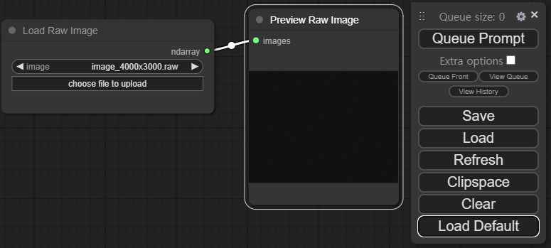

ComfyUI
=======
The most powerful and modular numpy GUI and backend.
-----------


This ui will let you design and execute advanced numpy pipelines using a graph/nodes/flowchart based interface. 

> This project is designed from [ComfyUI](https://github.com/comfyanonymous/ComfyUI) project which is for stable diffusion.

## Features
- Nodes/graph/flowchart interface to experiment and create complex numpy workflows without needing to code anything.
- Asynchronous Queue system
- Loading full workflows (with seeds) from generated PNG files.
- Saving/Loading workflows as Json files.
- Nodes interface can be used to create complex workflows like one for [Hires fix](https://comfyanonymous.github.io/ComfyUI_examples/2_pass_txt2img/) or much more advanced ones.
- Starts up very fast.
- Works fully offline: will never download anything.
Workflow examples can be found on the [Examples page](https://comfyanonymous.github.io/ComfyUI_examples/)

## Shortcuts

| Keybind                   | Explanation                                                                                                        |
|---------------------------|--------------------------------------------------------------------------------------------------------------------|
| Ctrl + Enter              | Queue up current graph for generation                                                                              |
| Ctrl + Shift + Enter      | Queue up current graph as first for generation                                                                     |
| Ctrl + Z/Ctrl + Y         | Undo/Redo                                                                                                          |
| Ctrl + S                  | Save workflow                                                                                                      |
| Ctrl + O                  | Load workflow                                                                                                      |
| Ctrl + A                  | Select all nodes                                                                                                   |
| Alt + C                   | Collapse/uncollapse selected nodes                                                                                 |
| Ctrl + M                  | Mute/unmute selected nodes                                                                                         |
| Ctrl + B                  | Bypass selected nodes (acts like the node was removed from the graph and the wires reconnected through)            |
| Delete/Backspace          | Delete selected nodes                                                                                              |
| Ctrl + Delete/Backspace   | Delete the current graph                                                                                           |
| Space                     | Move the canvas around when held and moving the cursor                                                             |
| Ctrl/Shift + Click        | Add clicked node to selection                                                                                      |
| Ctrl + C/Ctrl + V         | Copy and paste selected nodes (without maintaining connections to outputs of unselected nodes)                     |
| Ctrl + C/Ctrl + Shift + V | Copy and paste selected nodes (maintaining connections from outputs of unselected nodes to inputs of pasted nodes) |
| Shift + Drag              | Move multiple selected nodes at the same time                                                                      |
| Ctrl + D                  | Load default graph                                                                                                 |
| Q                         | Toggle visibility of the queue                                                                                     |
| H                         | Toggle visibility of history                                                                                       |
| R                         | Refresh graph                                                                                                      |
| Double-Click LMB          | Open node quick search palette                                                                                     |

Ctrl can also be replaced with Cmd instead for macOS users

# Installing

## Windows

There is a portable standalone build for Windows that should work for running on Nvidia GPUs or for running on your CPU only on the [releases page](https://github.com/comfyanonymous/ComfyUI/releases).

### [Direct link to download](https://github.com/comfyanonymous/ComfyUI/releases/download/latest/ComfyUI_windows_portable_nvidia_cu121_or_cpu.7z)

Simply download, extract with [7-Zip](https://7-zip.org) and run. Make sure you put your Stable Diffusion checkpoints/models (the huge ckpt/safetensors files) in: ComfyUI\models\checkpoints

If you have trouble extracting it, right click the file -> properties -> unblock

#### How do I share models between another UI and ComfyUI?

See the [Config file](extra_model_paths.yaml.example) to set the search paths for models. In the standalone windows build you can find this file in the ComfyUI directory. Rename this file to extra_model_paths.yaml and edit it with your favorite text editor.

## Jupyter Notebook

To run it on services like paperspace, kaggle or colab you can use my [Jupyter Notebook](notebooks/comfyui_colab.ipynb)

## Manual Install (Windows, Linux)

Git clone this repo.

Put your SD checkpoints (the huge ckpt/safetensors files) in: models/checkpoints

Put your VAE in: models/vae


# Installing

```Bash
git clone https://github.com/allinpy/ComfyUI-numpy.git
```

# Running

```python main.py```

# Notes

Only parts of the graph that have an output with all the correct inputs will be executed.

Only parts of the graph that change from each execution to the next will be executed, if you submit the same graph twice only the first will be executed. If you change the last part of the graph only the part you changed and the part that depends on it will be executed.

Dragging a generated png on the webpage or loading one will give you the full workflow including seeds that were used to create it.
